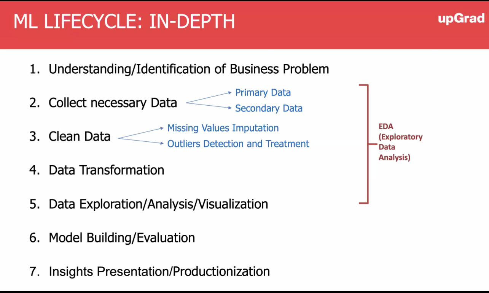
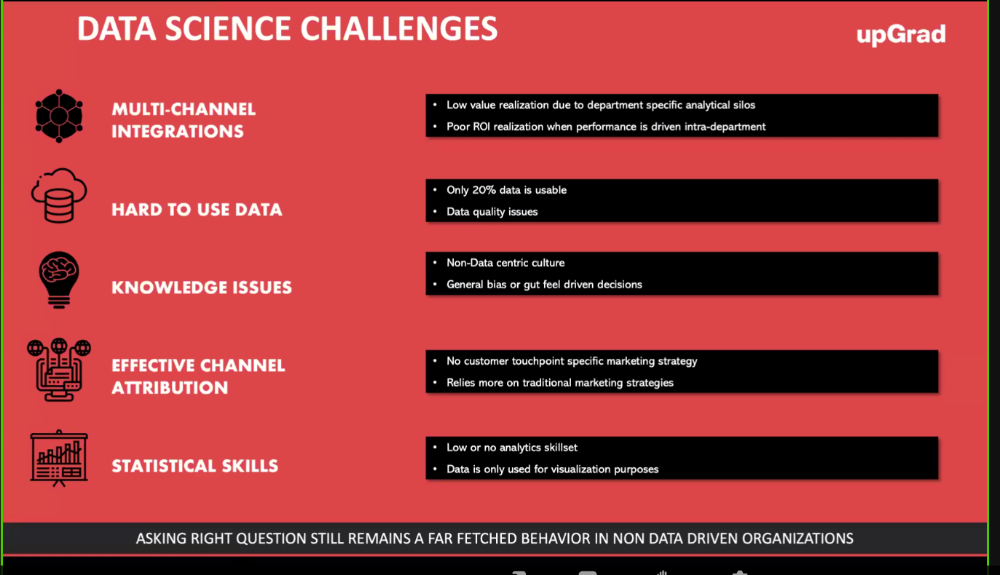
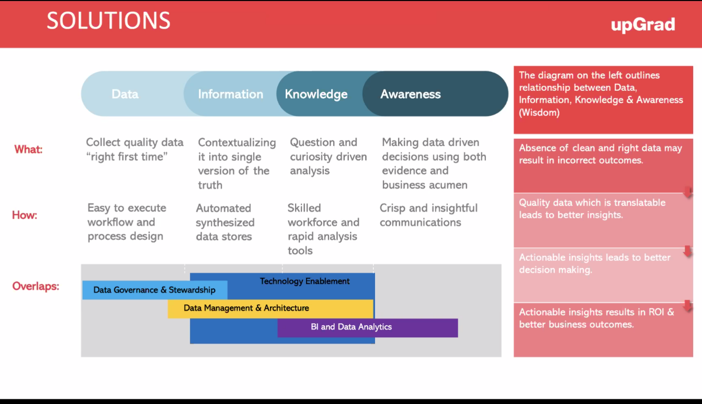
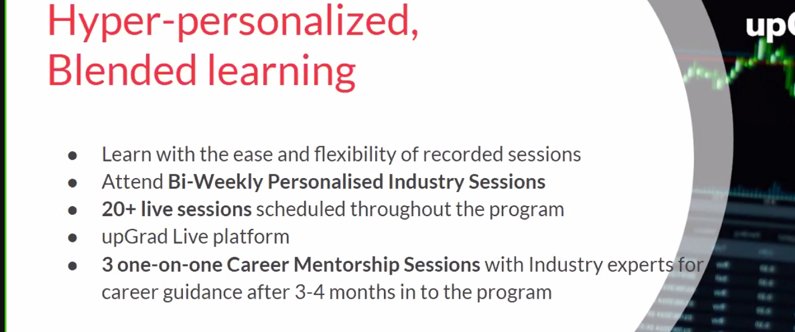
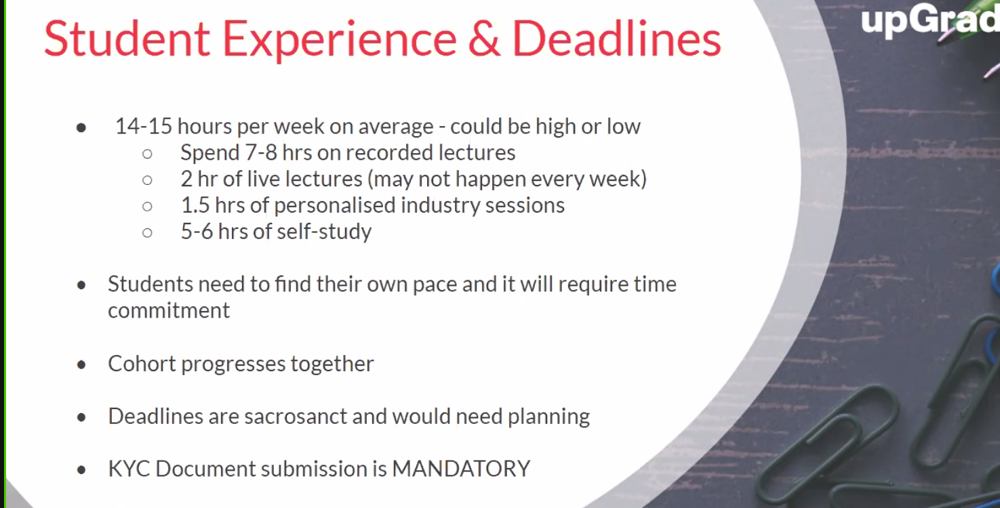
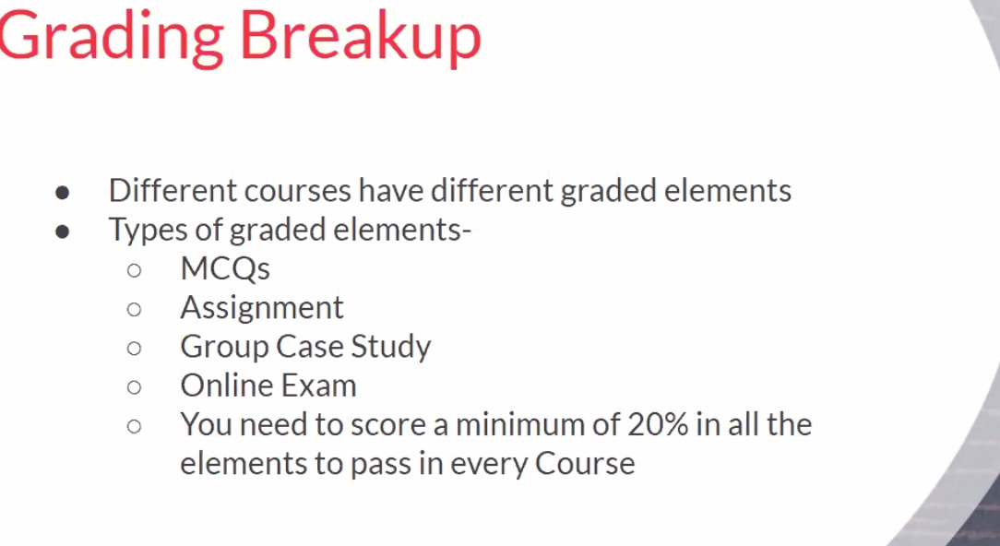
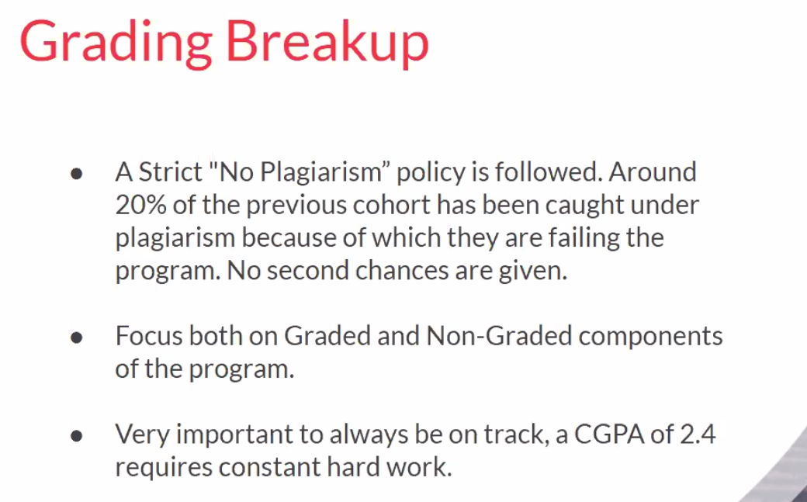
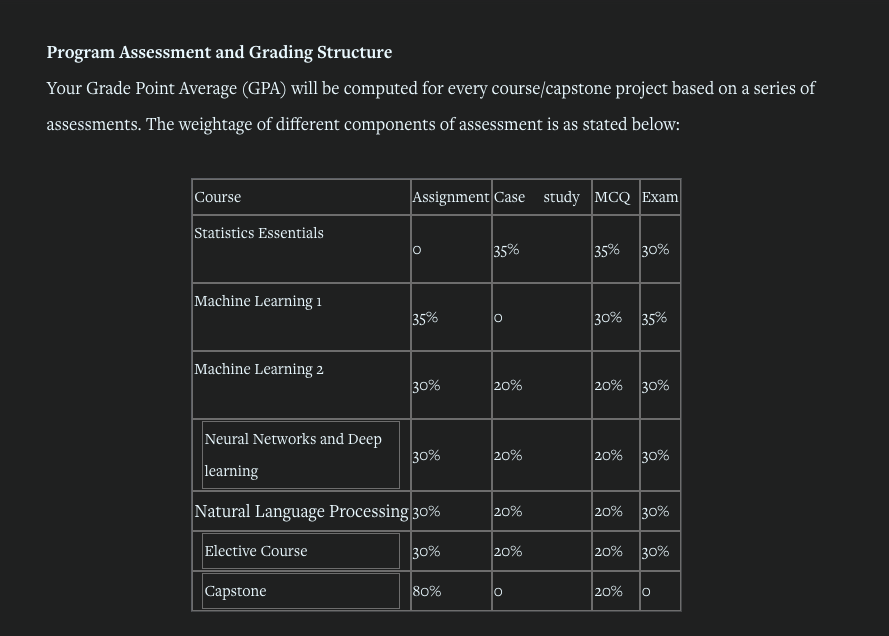
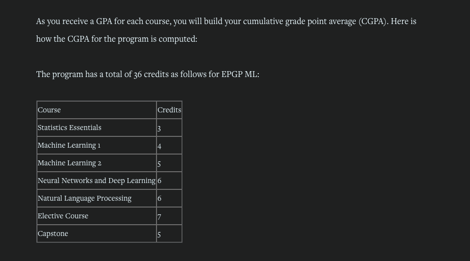

### Git sub-repos:

1. https://github.com/sreegithub19/upgrad_live_c41
2. https://github.com/sreegithub19/Course

### Nodejs in Jupyter notebook:

1. https://medium.com/codait/nodebooks-node-js-data-science-notebooks-aa140bea21ba
2. https://github.com/n-riesco/ijavascript 
(In Anaconda prompt)  
<ul>
<li>conda activate newenv</li>
<li>conda install nodejs</li>
<li>npm install -g ijavascript</li>
<li>ijsinstall</li>
<li>jupyter-notebook</li>
</ul>

### Assignments so far:

1.   
    LendingClub | Online Personal Loans at Great Rates:  
    <a href="https://www.lendingclub.com/">https://www.lendingclub.com/</a>

        Siddhesh Google drive link: https://drive.google.com/file/d/1oT65yjpCAtRyoMX6Xa6W2ORHBPXHa6DK/view?usp=sharing

        Final Submitted Github link: https://github.com/munirathinamd/LendingClubCaseStudy  
        Final Submission: https://cdn.upgrad.com/uploads/production/7aee9703-8361-43df-b652-ae0b96a5aab4/MunirathinamDuraisamy_LendingClubCaseStudy.txt  
        Location of assignment: http://localhost:8889/notebooks/2_Course_continuation/1_Statistics_essentials/4_Lending_club_case_study

2.   
    Linear regression assignment: (Bike_sharing_assignment)
     
        https://www.dropbox.com/scl/fo/vcj45zteqhi0qr9pl1xr8/h?dl=0&rlkey=aglrkxuyir3dob9t7j3fjesql

        https://www.kaggle.com/code/lakshmi25npathi/bike-rental-count-prediction-using-python/notebook

        Shared by professor:
        https://drive.google.com/drive/folders/1VjrHKtgjLzWk9W_ImvJnyuw37XCr-iQS 
        Location of assignment: http://localhost:8889/tree/2_Course_continuation/2_Machine_learning/1_Linear_regression/2_Bike_sharing_assignment 

3.   
    Advanced regression assignment (Advanced-House-Price-Regression) :  
        Shared by lecturer: 
        <a href="https://github.com/subhendughosh91/Advanced-House-Price-Regression">https://github.com/subhendughosh91/Advanced-House-Price-Regression</a> 
        Location of assignment: <a href="https://github.com/subhendughosh91/Advanced-House-Price-Regression">http://localhost:8888/tree/2_Course_continuation/3_Machine_learning_2/1_Advanced_regression/Assignment</a>

### Virtual env. in mac: (https://programwithus.com/learn/python/pip-virtualenv-mac)

1. pip3 install virtualenv
2. virtualenv env
3. source env/bin/activate
4. deactivate env (to deactivate)

### Managing python versions (Mac):

1. pyenv versions
2. pyenv global 3.8.0

### Welcome session

1. Leaderboard: https://learn.upgrad.com/course/3064/analytics

2. Scorecard: https://scorecard.upgrad.com/cohort/3064

3. LiveSession - upGrad : https://live.upgrad.com/

4. Prep sessions:  
   i. Data Science Tool Kit (Preparatory Content): https://learn.upgrad.com/course/3064?courseId=19539

   ii. Statistics Essentials : https://learn.upgrad.com/course/3064?courseId=23039

5. Kaggle: https://www.kaggle.com/

6. Whatsapp group: https://chat.whatsapp.com/ChOfahiSZaQE9RqHHaPOYt

7. Instructor's notebook: https://jovian.ai/shvmgrg98/ml-c41-python-crash-course-session-1

8. Reference books:
   i. Python Crash Course: A Hands-On, Project-Based Introduction to Programming by Eric Matthes - PDF Drive: https://www.pdfdrive.com/python-crash-course-a-hands-on-project-based-introduction-to-programming-d190067998.html

9. Personal Git repo: https://github.com/sreegithub19/upgrad

10. Instructor's Git repo: shvmgrg98/ml-c41-python-crash-course-session-1 – Jovian:
    https://jovian.ai/shvmgrg98/ml-c41-python-crash-course-session-1

11. Google docs batch details: https://docs.google.com/spreadsheets/d/1FSvPwGWYSAKTpcFE32hWpiF0YiXhCZhQEm7-V0zhvL0/edit#gid=0

12. Which cloud provider will be used in course to analyze the data?  
    Ans: Azure ML: https://azure.microsoft.com/en-in/services/machine-learning/

13. PPT:
    
    
    
    
    
    
    
    
    

14. Documents submission:
    https://docs.google.com/forms/d/e/1FAIpQLScKEXycwNHhd5o75IvaFvFFhanqoxLm3ON9qsAemY002wsWcA/closedform

15. Student manuals:  
    https://learn.upgrad.com/course/3064/segment/23039/140520/429715/2223146

16. PEER GROUP UPGRAD MLC41 (PeerGroup_upGrad_MLC41). List of Participants in the whatsapp group:
    https://docs.google.com/spreadsheets/d/1FSvPwGWYSAKTpcFE32hWpiF0YiXhCZhQEm7-V0zhvL0/edit?usp=sharing
17. Referral: https://referrals.upgrad.com/upgrad-referral-scheme?utm_source=Referrals_Referee&utm_medium=Popup+5th+Aug&utm_campaign=Popup+5th+Aug

18. Please fill the below form to get the information regarding Masters in ML & AI by LJMU. https://forms.gle/pgMhjhgFeg9J5iSo6

### Program structure

1. 7 courses with 40 graded modules:  
   We will cover these areas under the following seven courses:  
   i. Statistics and EDA : ~5 weeks  
   ii. Machine Learning 1 : ~6 weeks  
   iii. Machine Learning 2 : ~8 weeks  
   iv. Neural Networks and Deep Learning : ~8 weeks  
   v. Natural Language Processing : ~7 weeks   
   vi. Elective : ~10 weeks   
   vii. Capstone  : ~4 weeks   

 
2. 4 graded components: (passing criteria: 20)  
    i. MCQs  
    ii. Assignment  
    iii. Case study  
    iv. Examination  
    
 
3. There are three electives:  
    i. MLops + Advanced Computer Vision  
    ii. MLops + Advanced Natural Language Processing  
    iii. MLops + AI strategy   

### Python starter toolkit

---

General:

(i) Python: https://docs.python.org/3/

(ii) PyPI:

https://pypi.org/

Homepage: https://pip.pypa.io/en/stable/

(iii) Anaconda: https://docs.conda.io/en/latest/#

---

ML, AI, NLP, DL, DS:

(i) Numpy: https://numpy.org/doc/

(ii) Matplotlib : https://matplotlib.org/stable/index.html

(iii) Scipy: https://docs.scipy.org/doc/scipy/

(iv) Scikit-learn: https://scikit-learn.org/stable/

(v) Keras: https://keras.io/

(vi) Tensorflow: https://www.tensorflow.org/api_docs

(vii) PyTorch: https://pytorch.org/docs/stable/index.html

(viii) NLTK: https://www.nltk.org/

(ix) OpenCV: https://opencv.org/

(x) Theano: https://theano-pymc.readthedocs.io/en/latest/#

(xi) Seaborn: https://seaborn.pydata.org/index.html

(xii) Pandas: https://pandas.pydata.org/docs/

---

Web:

(https://wiki.python.org/moin/WebFrameworks)

(i) Flask: https://flask.palletsprojects.com/en/2.2.x/

(ii) Django: https://docs.djangoproject.com/en/4.1/

(iii) Web2Py: https://www.web2py.com/

(iv) Turbogears: https://turbogears.org/

---

Big Data:

(i) PySpark: https://spark.apache.org/docs/latest/api/python/

---

Gaming:

(i) PyGame: https://www.pygame.org/docs/

---

Database:

(https://docs.rackspace.com/blog/pymongo-and-other-python-modules-for-database-engines/)

(i) SQLite: https://www.sqlite.org/docs.html

(ii) (Oracle) python-oracledb: https://oracle.github.io/python-oracledb/

(iii) (PostgreSQL) psycopg2: https://www.psycopg.org/docs/

(iv) (MongoDB) pymongo: https://pymongo.readthedocs.io/en/stable/

(v) (MySQL) :

mysql.connector: https://dev.mysql.com/doc/connector-python/en/

pymysql: https://pymysql.readthedocs.io/en/latest/

(vi) (Cassandra) cassandra-driver: https://cassandra.apache.org/doc/latest/cassandra/getting_started/drivers.html

---

Testing:

(i) PyTest: https://docs.pytest.org/en/7.1.x/

(ii) Selenium: https://selenium-python.readthedocs.io/

(iii) Cucumber (Behave) : https://behave.readthedocs.io/en/stable/

---

Cloud:

(i) GCP: https://cloud.google.com/python/docs/reference

(ii) Azure: https://docs.microsoft.com/en-us/azure/developer/Python/

(iii) AWS: https://aws.amazon.com/sdk-for-python/

---

### Notes:

0.

- git rm --cached <path_to_folder_name> -r : This is to reflect changes in git in case folder names of .gitignore file are modified.

- git add . && git commit -m "C" && git push origin main

1. git branch -m main:

It will create another branch called ‘main’ and you will be directed to the main branch. If you type git branch after executing the above command, you will notice that your current branch has been changed from master to main.

2. ‘git reset’ goes back to the commit id that is mentioned and all the commits after that are erased.

3. ‘git revert’ will create another commit that shows that you are reverting back to the previous commit.

4. A Histogram plots the frequency of a numeric variable, whereas the Bar plot shows the aggregation of a certain numerical entity for some categorical variable. In Situation A, you are analysing the total sum of runs, which is a numeric variable for all the teams, which is a categorical variable. Hence it will need a bar plot. For Situation B, you're understanding the spread of a numeric variable by checking the frequency. Hence a histogram will be used here.

5. A categorical variable (sometimes called a nominal variable) is one that has two or more categories, but there is no intrinsic ordering to the categories.

---
